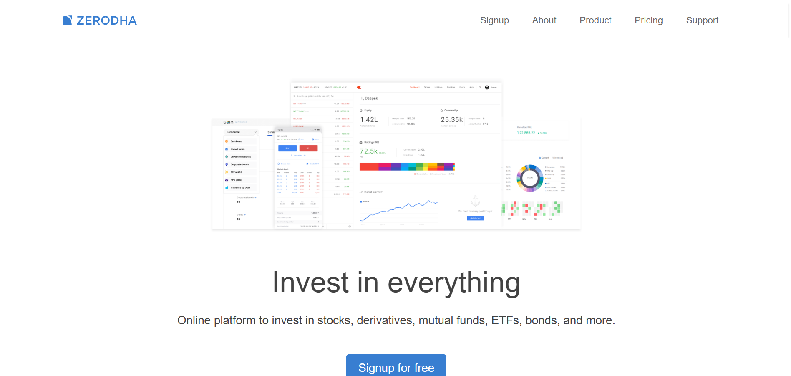

# Zerodha Landing Page Clone (Frontend Only)

A responsive frontend clone of [Zerodha's](https://zerodha.com) official landing page built using **pure HTML and CSS**. This project is a part of **Harkirat Singh's Web Development Cohort** aimed at building real-world UI clones without any frontend frameworks.

## 🛠️ Tech Stack

- **HTML5** – for content structure
- **CSS3** – for styling and layout
- **Flexbox** – for responsive alignment

---
